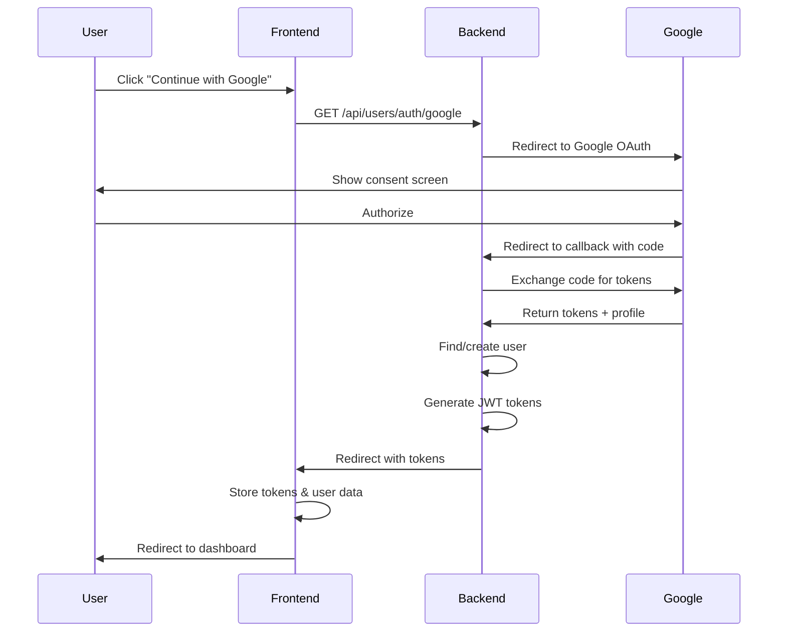
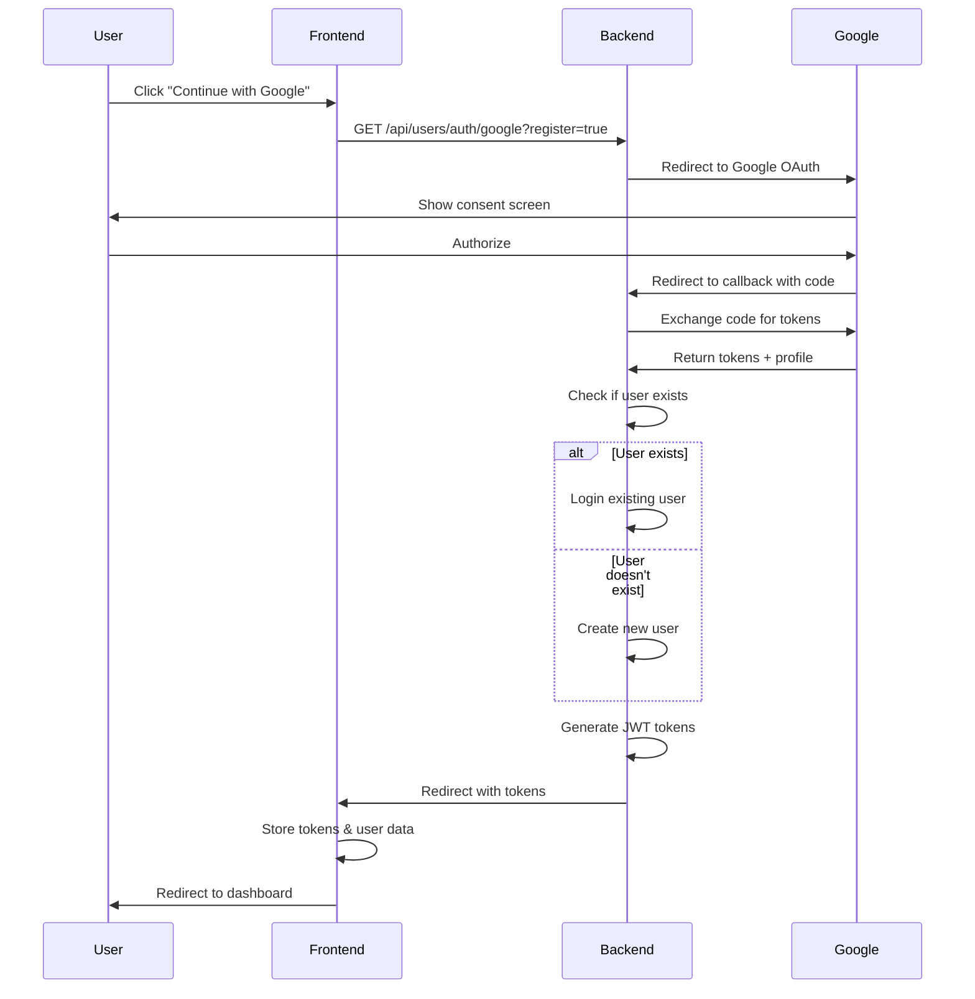

# Google OAuth Implementation Plan

## Overview
This plan outlines the implementation of Google OAuth authentication for both login and registration flows, integrating with the existing JWT-based authentication system.

## Architecture Decision
**Chosen Approach**: Passport.js with passport-google-oauth20 (backend OAuth flow)

**Rationale**:
- OAuth secrets remain secure on backend
- Integrates seamlessly with existing JWT token system
- Consistent with current architecture (Express + TypeScript)
- Easy to extend with additional OAuth providers
- Server-side control over user creation and validation

## Implementation Strategy

### 1. Backend Changes

#### 1.1 Install Required Dependencies
```bash
cd backend
npm install passport passport-google-oauth20 express-session
npm install --save-dev @types/passport @types/passport-google-oauth20 @types/express-session
```

#### 1.2 Update User Model
**File**: [`backend/src/models/User.ts`](backend/src/models/User.ts)

Add new fields to support OAuth:
- `google_id` (string, nullable) - Google user ID
- `provider` (enum: 'email', 'google', nullable) - Authentication provider
- `profile_picture` (string, nullable) - URL to user's profile picture
- `is_oauth_user` (boolean, default false) - Flag for OAuth users

**Migration Required**: Create migration to add these columns to the users table.

#### 1.3 Create Google OAuth Configuration
**File**: `backend/src/config/googleOAuth.ts`

Configure Passport.js Google strategy with:
- Client ID (from Google Cloud Console)
- Client Secret (from Google Cloud Console)
- Callback URL
- Profile fields to fetch

#### 1.4 Update Auth Service
**File**: [`backend/src/services/authService.ts`](backend/src/services/authService.ts)

Add methods:
- `handleGoogleLogin(profile)` - Handle Google OAuth login/registration
- `findOrCreateGoogleUser(profile)` - Find existing user or create new one
- `generateOAuthToken(user)` - Generate JWT token for OAuth user

#### 1.5 Create OAuth Controller
**File**: `backend/src/controllers/oauthController.ts`

Implement:
- `googleAuth()` - Redirect to Google OAuth
- `googleCallback()` - Handle Google OAuth callback
- Handle both login and registration scenarios

#### 1.6 Update User Routes
**File**: [`backend/src/routes/users.ts`](backend/src/routes/users.ts)

Add OAuth endpoints:
- `GET /api/users/auth/google` - Initiate Google OAuth
- `GET /api/users/auth/google/callback` - Google OAuth callback

#### 1.7 Update Server Configuration
**File**: [`backend/src/server.ts`](backend/src/server.ts)

- Configure Passport middleware
- Configure session middleware (for OAuth flow)
- Initialize Passport strategies

#### 1.8 Update Environment Variables
**File**: [`backend/.env.example`](backend/.env.example)

Add:
```
GOOGLE_CLIENT_ID=your_google_client_id
GOOGLE_CLIENT_SECRET=your_google_client_secret
GOOGLE_CALLBACK_URL=http://localhost:5000/api/users/auth/google/callback
```

---

### 2. Frontend Changes

#### 2.1 Install Google OAuth Library
```bash
npm install @google-cloud/oauth2
```

#### 2.2 Update Auth Context
**File**: [`src/contexts/AuthContext.tsx`](src/contexts/AuthContext.tsx)

Add methods:
- `loginWithGoogle()` - Initiate Google OAuth login
- `registerWithGoogle()` - Initiate Google OAuth registration
- Handle OAuth callback

#### 2.3 Update Login Page
**File**: [`src/pages/LoginPage.tsx`](src/pages/LoginPage.tsx)

Add:
- "Continue with Google" button
- Google icon
- Loading state during OAuth redirect
- Error handling for OAuth failures

#### 2.4 Update Register Page
**File**: [`src/pages/RegisterPage.tsx`](src/pages/RegisterPage.tsx)

Add:
- "Continue with Google" button
- Google icon
- Loading state during OAuth redirect
- Error handling for OAuth failures

#### 2.5 Create OAuth Callback Page
**File**: `src/pages/OAuthCallbackPage.tsx`

Handle OAuth callback:
- Parse callback parameters
- Call backend to complete authentication
- Store token and user data
- Redirect to appropriate page

---

### 3. OAuth Flow Diagrams

### Login Flow with Google


### Registration Flow with Google


---

### 4. User Account Linking Strategy

When a user signs up with Google:
1. Check if user exists by email
2. If exists and has password:
   - Option A: Ask user to link accounts (enter password)
   - Option B: Create separate Google-linked account
   - **Recommendation**: Option B for simplicity
3. If exists and is already Google user:
   - Login existing user
4. If doesn't exist:
   - Create new user with Google data

---

### 5. Data Model Changes

### Updated User Schema
```typescript
{
  id: string (UUID)
  email: string (unique)
  name: string
  password: string (nullable - OAuth users won't have this)
  google_id: string (nullable - for Google users)
  provider: enum ('email' | 'google' | null)
  profile_picture: string (nullable)
  is_oauth_user: boolean (default false)
  membership_tier: enum
  membership_expires_at: Date (nullable)
  email_verified: boolean (default true for OAuth users)
  created_at: Date
  updated_at: Date
}
```

---

### 6. Security Considerations

1. **OAuth Secrets**: Never expose client secret to frontend
2. **HTTPS Required**: OAuth requires HTTPS in production
3. **State Parameter**: Use state parameter to prevent CSRF attacks
4. **Token Storage**: Store JWT tokens in httpOnly cookies (optional enhancement)
5. **Email Verification**: Auto-verify emails from Google OAuth
6. **Password Reset**: OAuth users won't have password reset functionality

---

### 7. Error Handling

### OAuth-Specific Errors
- `OAuthError`: General OAuth failure
- `AccountExistsError`: User already exists with different provider
- `InvalidTokenError`: Invalid OAuth token
- `ProfileError`: Unable to fetch user profile from Google

### Frontend Error Messages
- "Failed to connect with Google. Please try again."
- "An account with this email already exists. Please login with your password."
- "Unable to create account. Please try again."

---

### 8. Testing Strategy

### Backend Tests
1. Unit tests for OAuth service methods
2. Integration tests for OAuth endpoints
3. Test user creation with Google data
4. Test existing user login with Google
5. Test error scenarios (invalid tokens, etc.)

### Frontend Tests
1. Test Google button renders correctly
2. Test OAuth redirect initiates
3. Test callback handling
4. Test error states display correctly

### Manual Testing
1. Create new account with Google
2. Login existing Google user
3. Try to register with Google when email already exists
4. Test on mobile devices
5. Test with different Google accounts

---

### 9. Google Cloud Console Setup

### Required Steps
1. Create a new project in Google Cloud Console
2. Enable Google+ API (or People API)
3. Create OAuth 2.0 credentials
4. Add authorized redirect URIs:
   - Development: `http://localhost:5000/api/users/auth/google/callback`
   - Production: `https://your-domain.com/api/users/auth/google/callback`
5. Copy Client ID and Client Secret to `.env` file

### Scopes to Request
- `profile` - Basic profile information
- `email` - User's email address

---

### 10. Migration Steps

### Database Migration
```sql
-- Add OAuth-related columns to users table
ALTER TABLE users
ADD COLUMN google_id VARCHAR(255) UNIQUE,
ADD COLUMN provider VARCHAR(20) CHECK (provider IN ('email', 'google')),
ADD COLUMN profile_picture TEXT,
ADD COLUMN is_oauth_user BOOLEAN DEFAULT false;

-- Create index on google_id for faster lookups
CREATE INDEX idx_users_google_id ON users(google_id);
```

---

### 11. Deployment Considerations

### Environment Variables
Ensure the following are set in production:
- `GOOGLE_CLIENT_ID`
- `GOOGLE_CLIENT_SECRET`
- `GOOGLE_CALLBACK_URL` (must use HTTPS)
- `SESSION_SECRET` (for session management)

### Callback URL
Update callback URL to production domain before deploying.

---

### 12. Future Enhancements

1. **Multiple OAuth Providers**: Add Facebook, Apple, GitHub
2. **Account Linking**: Allow users to link multiple providers to one account
3. **Profile Picture Sync**: Sync profile picture from Google periodically
4. **Password Reset for OAuth Users**: Allow setting password for OAuth users
5. **OAuth Token Refresh**: Refresh Google access tokens if needed

---

### 13. Implementation Order

1. **Backend Setup**
   - Install dependencies
   - Update User model
   - Create migration
   - Configure Passport.js
   - Implement OAuth controller
   - Add OAuth routes
   - Update server configuration

2. **Frontend Setup**
   - Install dependencies
   - Update AuthContext
   - Update LoginPage
   - Update RegisterPage
   - Create OAuthCallbackPage

3. **Testing**
   - Test backend OAuth flow
   - Test frontend OAuth flow
   - Test error scenarios
   - Manual testing

4. **Documentation**
   - Update README
   - Document environment variables
   - Create setup guide

---

### 14. Files to Create/Modify

### New Files
- `backend/src/config/googleOAuth.ts`
- `backend/src/controllers/oauthController.ts`
- `src/pages/OAuthCallbackPage.tsx`
- `backend/migrations/XXXXXX-add-oauth-fields.js`

### Modified Files
- `backend/src/models/User.ts`
- `backend/src/services/authService.ts`
- `backend/src/routes/users.ts`
- `backend/src/server.ts`
- `backend/package.json`
- `backend/.env.example`
- `src/contexts/AuthContext.tsx`
- `src/pages/LoginPage.tsx`
- `src/pages/RegisterPage.tsx`
- `package.json`

---

### 15. Success Criteria

- [ ] Users can login with Google
- [ ] Users can register with Google
- [ ] Google users are auto-verified
- [ ] Existing email users can still login with password
- [ ] OAuth users have profile pictures
- [ ] Error handling works correctly
- [ ] JWT tokens are generated for OAuth users
- [ ] Session management works with OAuth
- [ ] Mobile-friendly Google login
- [ ] All tests pass
