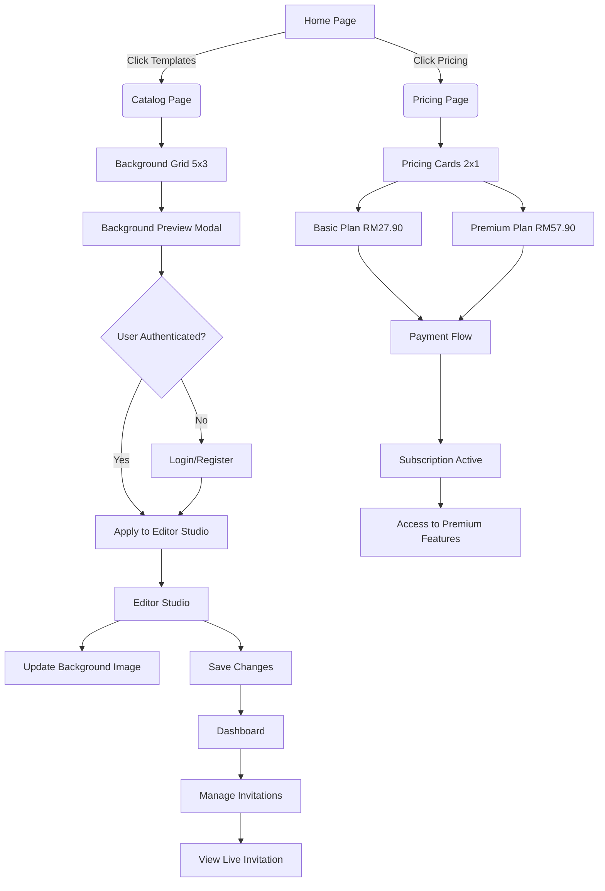
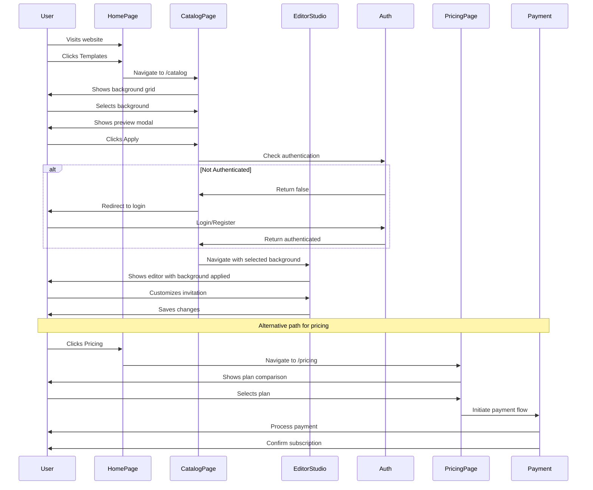
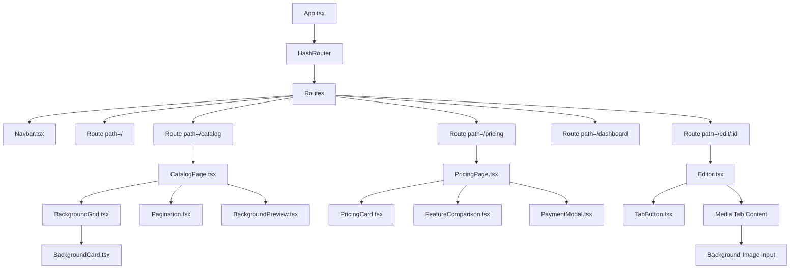
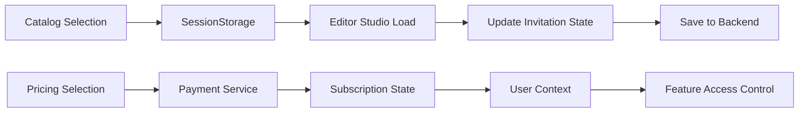
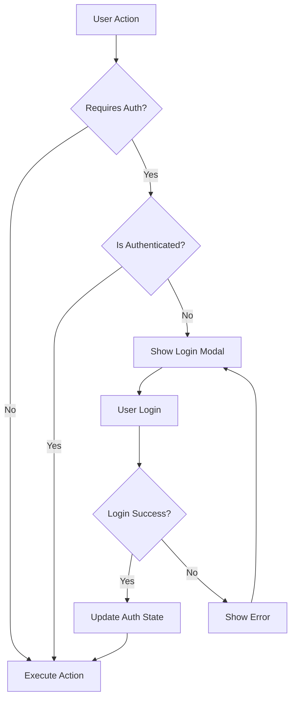

# System Flow Diagram

## Catalog & Pricing Integration Flow



## User Journey Flow



## Component Hierarchy



## State Management Flow



## Authentication Flow



## Background Selection Flow

```mermaid
graph TD
    A[User Views Catalog] --> B[Selects Background]
    B --> C[Preview Modal Opens]
    C --> D[Clicks Apply Button]
    D --> E[Check Authentication]
    E -->|Not Authenticated| F[Redirect to Login]
    F --> G[After Login]
    E -->|Authenticated| G
    G --> H[Navigate to Editor]
    H --> I[Pass Background ID in State]
    I --> J[Editor Loads Background]
    J --> K[Update background_image field]
    K --> L[User Can Customize]
    L --> M[Save Invitation]